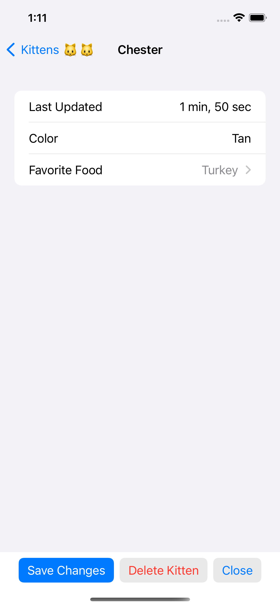

# Full-Stack Swift Example

This directory contains a full-stack Swift example application that supports managing a list of kittens via typical CRUD operations. The backend server is written using Vapor and the MongoDB Swift driver, which lives in the [Backend](./Backend) directory. The frontend is an iOS application as defined in [iOSApp](./iOSApp), which communicates with the backend via HTTP. 

The same `Codable` data model types are shared between the frontend and backend, and so they are defined in their own `Models` SwiftPM package.

The backend portion of the application requires Swift 5.5.2+ and MongoDB 3.6+. It will run on Linux as well as macOS 12+. The frontend iOS portion requires Xcode 13.2+.

For more details on each component, please review the corresponding README files: [backend](./Backend/README.md), [frontend](./iOSApp/README.md), [models](./Models/README.md).

## Building and Running the Application

### 1. (Linux only) Install required system library dependencies
If you are on Linux and attempting to run the backend server, you will need to install some system libraries which are dependencies of the MongoDB C driver (libmongoc), which the Swift driver depends on a vendored copy of. To install these, please follow the instructions [here](http://mongoc.org/libmongoc/current/installing.html#prerequisites-for-libmongoc) from libmongoc's documentation.

### 2. Start a MongoDB instance for the application to connect to. You can either do this using MongoDB Atlas (recommended) or locally.
a. *MongoDB Atlas*: Follow the steps in the tutorial [here](https://docs.atlas.mongodb.com/getting-started/), using the MongoDB shell (`mongosh`) as your connection method in parts 5 and 6.

b. *Locally*: Install and run MongoDB by following the instructions [here](https://docs.mongodb.com/manual/administration/install-community/).

### 3. Load sample data into MongoDB.
1. Open a new terminal window. Navigate to the [Backend] directory.
2. (Only needed if you used MongoDB Atlas in the previous step) Store the connection string in an environment variable:
```
export MONGODB_URI=your-connection-string-here
```
3. Run `./loadData.sh` to load sample data into the database.

### 4. Build and run the backend
1. Using the same terminal as the previous step, run `swift run` from the `Backend` directory. This will build and run the backend server. The first time you run this command, it will take a while as all the application's dependencies will need to be downloaded and built as well. You should eventually get a message that the server has started running on `http://127.0.0.1:8080`.
2. To test that the backend is working as expected, open a new terminal window and use `curl`  to query the server:
```
curl http://127.0.0.1:8080
```

You should see JSON output in response that looks something like:
```
[{"lastUpdateTime":{"$date":"2022-03-03T20:52:04.318Z"},"_id":{"$oid":"62212a74c231bd795259bfa8"},"favoriteFood":"salmon","name":"Roscoe","color":"orange"},{"name":"Chester","favoriteFood":"turkey","_id":{"$oid":"62212a74c231bd795259bfa9"},"color":"tan","lastUpdateTime":{"$date":"2022-03-03T20:52:04.318Z"}}]
```

### 5. Build and run the iOS app in a simulator
1. Open the project in Xcode. To do this, you can either:
    a. In a new terminal window, navigate to the `iOSApp` directory, and run `xed .`, or
    b. Open Xcode, then in the menu bar go to File > Open... and locate the `iOSApp` directory in the file finder.
2. In the top bar on Xcode, select a simulator to target, for example "iPhone 13".
3. In the top bar on Xcode, click the triangle "play" button to build the application and launch the simulator.
4. You should then be able to see the sample data we loaded above and create/update/delete kittens from the simulator UI.



_Screenshots of the views you should see in the iOS simulator._

<!-- 
 -->

## Acknowledgements
The design and implementation of the iOS portion of this application were heavily influenced by this [YouTube series](https://www.youtube.com/playlist?list=PLMRqhzcHGw1Z7xNnqS_yUNm1k9dvq-HbM) by [Mikaela Caron](https://github.com/mikaelacaron).
